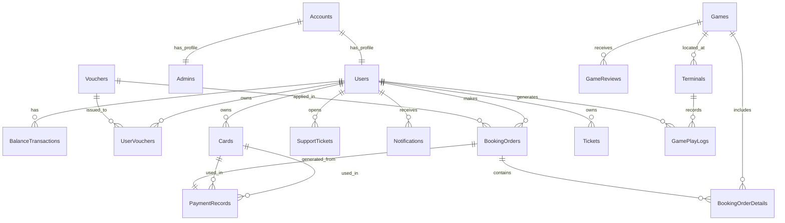

# 🗄️ Cấu Trúc Cơ Sở Dữ Liệu (Database Schema) - Park Adventure

Dưới đây là thiết kế chi tiết các bảng dữ liệu cần thiết cho hệ thống, bao gồm Users, Games, Vouchers, Transactions và hệ thống Support.

## 📊 Sơ Đồ Quan Hệ (ER Diagram)

## 📝 Chi Tiết Các Bảng

### 1. � Accounts (Tài khoản đăng nhập) - `accounts`
Lưu trữ thông tin xác thực (Authentication).

| Column Name | Data Type | Description |
| :--- | :--- | :--- |
| `account_id` | UUID (PK) | Khóa chính. |
| `phone_number` | VARCHAR(15) | Số điện thoại (dùng để đăng nhập), Unique. |
| `password_hash` | VARCHAR(255) | Mật khẩu đã mã hóa. |
| `role` | ENUM | 'USER', 'ADMIN', 'STAFF'. |
| `status` | ENUM | 'ACTIVE', 'BANNED'. |
| `last_login` | TIMESTAMP | Thời gian đăng nhập cuối. |
| `last_login` | TIMESTAMP | Thời gian đăng nhập cuối. |

### 1c. 👮 Admins/Staff (Hồ sơ nhân viên) - `admins`
Lưu trữ thông tin nhân viên, quản lý và phân quyền chi tiết.
*Liên kết 1-1 với bảng Accounts (khi role = ADMIN/STAFF).*

| Column Name | Data Type | Description |
| :--- | :--- | :--- |
| `admin_id` | UUID (PK) | Khóa chính. |
| `account_id` | UUID (FK) | Liên kết tới tài khoản đăng nhập (Unique). |
| `full_name` | VARCHAR(100) | Tên nhân viên. |
| `employee_code` | VARCHAR(20) | Mã nhân viên (VD: NV001). |
| `department` | VARCHAR(50) | Bộ phận (Kế toán, Vận hành, CSKH...). |
| `permissions` | JSON/TEXT | Danh sách quyền hạn chi tiết (VD: ['VIEW_DASHBOARD', 'APPROVE_REFUND']). |
| `last_action_at` | TIMESTAMP | Thời gian thao tác cuối cùng (để audit). |

### 1b. 👤 Users (Hồ sơ người dùng) - `users`
Lưu trữ thông tin cá nhân và ví tiền (Business Data).
*Liên kết 1-1 với bảng Accounts.*

| Column Name | Data Type | Description |
| :--- | :--- | :--- |
| `user_id` | UUID (PK) | Khóa chính. |
| `account_id` | UUID (FK) | Liên kết tới tài khoản đăng nhập (Unique). |
| `full_name` | VARCHAR(100) | Tên hiển thị. |
| `membership_level` | ENUM | Hạng thành viên ('BRONZE', 'SILVER', 'GOLD', 'PLATINUM'). Default: 'BRONZE'. |
| `current_balance` | DECIMAL | Số dư ví hiện tại. Default: 0. |
| `loyalty_points` | INT | Điểm thưởng tích lũy. Default: 0. |
| `avatar_url` | TEXT | Link ảnh đại diện. |
| `is_card_locked` | BOOLEAN | Trạng thái khóa thẻ (True = Đang khóa). |
| `referral_code` | VARCHAR(20) | Mã giới thiệu riêng của user. |
| `referred_by` | UUID (FK) | ID của người đã giới thiệu user này (nếu có). |
| `created_at` | TIMESTAMP | Thời gian tạo hồ sơ. |

### 2. 💳 Cards (Thẻ vật lý) - `cards`
Quản lý thông tin thẻ JavaCard và liên kết với người dùng.

| Column Name | Data Type | Description |
| :--- | :--- | :--- |
| `card_id` | UUID (PK) | Khóa chính của bản ghi thẻ trong DB. |
| `physical_card_uid` | VARCHAR(50) | **Hextring UID** của chip thẻ (Duy nhất). |
| `user_id` | UUID (FK) | Người sở hữu (NULL nếu là thẻ trắng chưa kích hoạt). |
| `status` | ENUM | 'ACTIVE', 'BLOCKED', 'LOST', 'INACTIVE'. |
| `pin_hash` | VARCHAR | **Mã hóa (Hash)** của mã PIN. Server không lưu PIN gốc. |
| `issued_at` | TIMESTAMP | Thời gian kích hoạt/liên kết vào tài khoản. |
| `last_synced_at` | TIMESTAMP | Lần cuối thẻ đồng bộ với Server. |

### 2. 🎡 Games (Trò chơi) - `games`
Danh sách các trò chơi và dịch vụ trong công viên.

| Column Name | Data Type | Description |
| :--- | :--- | :--- |
| `game_id` | UUID (PK) | Khóa chính. |
| `name` | VARCHAR(100) | Tên trò chơi. |
| `description` | TEXT | Mô tả chi tiết. |
| `price_per_turn` | DECIMAL | Giá vé gốc cho 1 lượt chơi. |
| `location` | VARCHAR(100) | Vị trí (Khu A, Khu B, Indoor...). |
| `thumbnail_url` | TEXT | Ảnh đại diện trò chơi. |
| `age_required` | INT | Tuổi tối thiểu yêu cầu. |
| `height_required` | INT | Chiều cao tối thiểu (cm). |
| `status` | ENUM | Trạng thái ('ACTIVE', 'MAINTENANCE', 'CLOSED'). |
| `location` | VARCHAR(100) | Vị trí (Khu A, Khu B, Indoor...). |
| `thumbnail_url` | TEXT | Ảnh đại diện trò chơi. |
| `age_required` | INT | Tuổi tối thiểu yêu cầu. |
| `height_required` | INT | Chiều cao tối thiểu (cm). |
| `status` | ENUM | Trạng thái ('ACTIVE', 'MAINTENANCE', 'CLOSED'). |
| `risk_level` | INT | Mức độ mạo hiểm (1-5). |

### 3. 🎟️ Tickets (Vé game đã mua) - `tickets`
Quản lý các lượt chơi game mà người dùng đã mua trước (Pre-paid) hoặc được tặng.
*Dùng cho trường hợp mua Combo hoặc vé lẻ thay vì trừ tiền trực tiếp.*

| Column Name | Data Type | Description |
| :--- | :--- | :--- |
| `ticket_id` | UUID (PK) | Khóa chính. |
| `user_id` | UUID (FK) | Người sở hữu. |
| `game_id` | UUID (FK) | Vé của trò chơi nào. |
| `purchase_order_id` | UUID (FK) | Mua từ đơn hàng nào (để truy xuất nguồn gốc). |
| `remaining_turns` | INT | Số lượt chơi còn lại (VD: Mua combo 5 lượt thì còn 5). |
| `status` | ENUM | 'VALID', 'USED', 'EXPIRED', 'CANCELLED'. |
| `expiry_date` | TIMESTAMP | Thời hạn sử dụng vé. |
| `qr_code_data` | VARCHAR | Mã QR định danh vé này (để quét vào cổng nếu không dùng thẻ). |

### 3. 🎫 Vouchers (Mã giảm giá) - `vouchers`
Các loại mã giảm giá do hệ thống tạo ra.

| Column Name | Data Type | Description |
| :--- | :--- | :--- |
| `voucher_id` | UUID (PK) | Khóa chính. |
| `code` | VARCHAR(50) | Mã voucher (VD: SUMMER2024). |
| `title` | VARCHAR(100) | Tên hiển thị (VD: Giảm 20%). |
| `discount_type` | ENUM | Loại giảm ('PERCENT', 'FIXED_AMOUNT'). |
| `discount_value` | DECIMAL | Giá trị giảm (VD: 20 hoặc 50000). |
| `min_order_value` | DECIMAL | Giá trị đơn hàng tối thiểu để áp dụng. |
| `usage_limit` | INT | Tổng số lượt dùng tối đa của voucher này. |
| `start_date` | TIMESTAMP | Ngày bắt đầu hiệu lực. |
| `end_date` | TIMESTAMP | Ngày hết hạn. |

### 4. 🎟️ User Vouchers (Voucher của người dùng) - `user_vouchers` 
Mapping giữa User và Voucher (Voucher người dùng đã lưu hoặc được tặng).

| Column Name | Data Type | Description |
| :--- | :--- | :--- |
| `id` | UUID (PK) | Khóa chính. |
| `user_id` | UUID (FK) | Người sở hữu. |
| `voucher_id` | UUID (FK) | Voucher sở hữu. |
| `is_used` | BOOLEAN | Đã sử dụng chưa. |
| `used_at` | TIMESTAMP | Thời gian sử dụng (nếu đã dùng). |

### 5. 💰 Transactions (Giao dịch ví) - `balance_transactions`
Lịch sử biến động số dư (Nạp tiền, thanh toán, hoàn tiền).

| Column Name | Data Type | Description |
| :--- | :--- | :--- |
| `transaction_id` | UUID (PK) | Khóa chính. |
| `user_id` | UUID (FK) | Người thực hiện. |
| `amount` | DECIMAL | Số tiền (+/-). VD: +50k (Nạp), -20k (Chơi game). |
| `type` | ENUM | Loại ('TOPUP', 'PAYMENT', 'REFUND', 'BONUS'). |
| `description` | TEXT | Mô tả giao dịch. |
| `created_at` | TIMESTAMP | Thời gian giao dịch. |

### 6. 🛒 Orders (Đơn hàng mua vé) - `booking_orders`
Lịch sử mua vé game.

| Column Name | Data Type | Description |
| :--- | :--- | :--- |
| `order_id` | UUID (PK) | Khóa chính. |
| `user_id` | UUID (FK) | Người mua. |
| `total_amount` | DECIMAL | Tổng tiền sau khi giảm giá. |
| `voucher_id` | UUID (FK) | Voucher đã áp dụng (nếu có). |
| `status` | ENUM | Trạng thái ('COMPLETED', 'CANCELLED'). |
| `created_at` | TIMESTAMP | Thời gian mua. |

### 7. 🧾 Order Details (Chi tiết đơn hàng) - `booking_order_details`
Chi tiết từng game trong một đơn hàng (vì 1 đơn có thể mua nhiều vé).

| Column Name | Data Type | Description |
| :--- | :--- | :--- |
| `detail_id` | UUID (PK) | Khóa chính. |
| `order_id` | UUID (FK) | Thuộc đơn hàng nào. |
| `game_id` | UUID (FK) | Vé trò chơi nào. |
| `quantity` | INT | Số lượng vé. |
| `unit_price` | DECIMAL | Giá vé tại thời điểm mua. |

### 8. 💳 Payment Records (Lịch sử thanh toán nạp tiền) - `payment_records`
Lịch sử nạp tiền từ cổng thanh toán bên ngoài (MoMo/Bank).

| Column Name | Data Type | Description |
| :--- | :--- | :--- |
| `payment_id` | UUID (PK) | Khóa chính. |
| `user_id` | UUID (FK) | Người nạp. |
| `method` | ENUM | Phương thức ('MOMO', 'VNPAY', 'BANKING', 'CASH'). |
| `amount` | DECIMAL | Số tiền nạp. |
| `status` | ENUM | Trạng thái ('SUCCESS', 'PENDING', 'FAILED'). |
| `external_ref_id` | VARCHAR | Mã giao dịch từ phía MoMo/Bank (để đối soát). |
| `created_at` | TIMESTAMP | Thời gian tạo yêu cầu nạp. |

### 9. 🔔 Notifications (Thông báo) - `notifications`
| Column Name | Data Type | Description |
| :--- | :--- | :--- |
| `notification_id` | UUID (PK) | Khóa chính. |
| `user_id` | UUID (FK) | Người nhận. |
| `title` | VARCHAR | Tiêu đề. |
| `message` | TEXT | Nội dung. |
| `is_read` | BOOLEAN | Đã đọc chưa. |
| `created_at` | TIMESTAMP | Thời gian gửi. |

### 10. 💬 Support Messages (Tin nhắn hỗ trợ) - `support_messages`
| Column Name | Data Type | Description |
| :--- | :--- | :--- |
| `message_id` | UUID (PK) | Khóa chính. |
| `user_id` | UUID (FK) | Người gửi (khách hàng). |
| `admin_id` | UUID (FK) | Admin trả lời (NULL nếu là tin nhắn của user). |
| `content` | TEXT | Nội dung tin nhắn. |
| `is_from_user` | BOOLEAN | True nếu là tin nhắn của user, False nếu là của Admin/Bot. |
| `created_at` | TIMESTAMP | Thời gian nhắn. |

### 11. 📟 Terminals (Máy quẹt thẻ / Thiết bị) - `terminals`
Quản lý các thiết bị phần cứng tại công viên.
| Column Name | Data Type | Description |
| :--- | :--- | :--- |
| `terminal_id` | UUID (PK) | Khóa chính. |
| `name` | VARCHAR(100) | Tên thiết bị (VD: Cổng vào Tàu lượn 1). |
| `game_id` | UUID (FK) | Gắn với trò chơi nào (nếu có). |
| `status` | ENUM | 'ONLINE', 'OFFLINE', 'MAINTENANCE'. |
| `ip_address` | VARCHAR(45) | Địa chỉ IP (để quản lý từ xa). |
| `last_heartbeat` | TIMESTAMP | Thời gian cuối cùng thiết bị báo về server. |

### 12. 📜 Game Play Logs (Nhật ký chơi game) - `game_play_logs`
Quan trọng để đối soát và phân tích hành vi (khác với giao dịch tài chính).
| Column Name | Data Type | Description |
| :--- | :--- | :--- |
| `log_id` | UUID (PK) | Khóa chính. |
| `terminal_id` | UUID (FK) | Chơi tại máy nào. |
| `card_id` | UUID (FK) | Dùng thẻ nào (hoặc NULL nếu dùng QR App). |
| `user_id` | UUID (FK) | Người chơi. |
| `game_id` | UUID (FK) | Trò chơi gì. |
| `played_at` | TIMESTAMP | Thời gian chơi thực tế. |
| `method` | ENUM | 'CARD_TAP', 'QR_SCAN'. |

### 13. ⭐ Game Reviews (Đánh giá) - `game_reviews`
| Column Name | Data Type | Description |
| :--- | :--- | :--- |
| `review_id` | UUID (PK) | Khóa chính. |
| `user_id` | UUID (FK) | Người đánh giá. |
| `game_id` | UUID (FK) | Trò chơi được đánh giá. |
| `rating` | INT | Điểm sao (1-5). |
| `comment` | TEXT | Nội dung nhận xét. |
| `created_at` | TIMESTAMP | Thời gian đánh giá. |

### 14. 🎫 Support Tickets (Phiếu hỗ trợ) - `support_tickets`
Quản lý luồng chat hỗ trợ (thay thế cho việc chỉ có messages rời rạc).
| Column Name | Data Type | Description |
| :--- | :--- | :--- |
| `ticket_id` | UUID (PK) | Khóa chính. |
| `user_id` | UUID (FK) | Người yêu cầu. |
| `subject` | VARCHAR(200) | Vấn đề cần hỗ trợ (VD: Lỗi nạp tiền). |
| `status` | ENUM | 'OPEN', 'IN_PROGRESS', 'RESOLVED', 'CLOSED'. |
| `priority` | ENUM | 'LOW', 'MEDIUM', 'HIGH'. |
| `created_at` | TIMESTAMP | Thời gian tạo. |
| `updated_at` | TIMESTAMP | Thời gian cập nhật cuối. |
