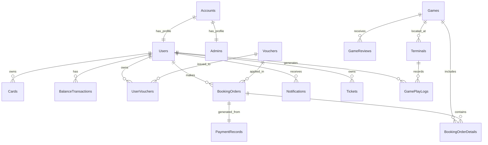

# 📄 TÀI LIỆU ĐỒ ÁN TỐT NGHIỆP

# 🎡 PARK ADVENTURE — Hệ Thống Quản Lý Công Viên Giải Trí Thông Minh

**Tên đề tài:** Xây dựng hệ thống quản lý và vận hành công viên giải trí áp dụng công nghệ thẻ thông minh (Smart Card) và thanh toán không tiền mặt (Cashless)

**Sinh viên thực hiện:** Mai Văn Tĩnh

**Ngày cập nhật:** 06/03/2026

---

## 📋 MỤC LỤC

1. [Giới Thiệu Tổng Quan](#1-giới-thiệu-tổng-quan)
2. [Kiến Trúc Hệ Thống](#2-kiến-trúc-hệ-thống)
3. [Công Nghệ Sử Dụng](#3-công-nghệ-sử-dụng)
4. [Cấu Trúc Mã Nguồn](#4-cấu-trúc-mã-nguồn)
5. [Ứng Dụng Di Động (Appcongvien)](#5-ứng-dụng-di-động-appcongvien)
6. [Backend Server](#6-backend-server)
7. [Ứng Dụng Quản Trị Desktop (appdesktop)](#7-ứng-dụng-quản-trị-desktop-appdesktop)
8. [Module Kiểm Thử NFC (TestNFC)](#8-module-kiểm-thử-nfc-testnfc)
9. [Cơ Sở Dữ Liệu](#9-cơ-sở-dữ-liệu)
10. [API Endpoints](#10-api-endpoints)
11. [Luồng Nghiệp Vụ Chính](#11-luồng-nghiệp-vụ-chính)
12. [Bảo Mật](#12-bảo-mật)
13. [Hướng Dẫn Cài Đặt & Chạy](#13-hướng-dẫn-cài-đặt--chạy)

---

## 1. Giới Thiệu Tổng Quan

### 1.1 Bối Cảnh & Vấn Đề

Các công viên giải trí truyền thống gặp nhiều bất cập trong vận hành:
- Xếp hàng mua vé giấy gây mất thời gian cho khách.
- Quản lý tiền mặt phức tạp, rủi ro thất thoát.
- Khó theo dõi doanh thu và hành vi khách hàng theo thời gian thực.
- Thiếu chương trình khách hàng thân thiết hiệu quả.

### 1.2 Giải Pháp

**Park Adventure** là một hệ sinh thái phần mềm kết hợp phần cứng nhằm **số hóa toàn bộ trải nghiệm vui chơi** tại công viên. Hệ thống loại bỏ vé giấy và tiền mặt, thay thế bằng **Thẻ thông minh (Smart Card)** và **Ứng dụng di động (Mobile App)**.

### 1.3 Triết Lý Thiết Kế: "Unified Balance" (Tài Chính Hợp Nhất)

- **"Tiền ở đâu cũng là một"**: Số dư trên Thẻ và trên App là duy nhất.
- **Real-time Banking**: Mọi giao dịch được xử lý tức thời trên Server trung tâm (Core Banking). Thẻ đóng vai trò là chìa khóa xác thực (Token), không lưu tiền trực tiếp.
- **Self-Service**: Khách hàng tự mua thẻ trắng, tự kích hoạt qua App, tự nạp tiền — không cần nhân viên hỗ trợ.

### 1.4 Các Tính Năng Nổi Bật

| # | Tính Năng | Mô Tả |
|---|-----------|-------|
| 1 | Quản lý thẻ thành viên | Kích hoạt, khóa/mở khóa, xem thông tin thẻ NFC |
| 2 | Nạp tiền đa kênh | Hỗ trợ MoMo, VNPay, Ngân hàng |
| 3 | Mua vé game online | Chọn game, thêm giỏ hàng, áp voucher, thanh toán |
| 4 | Hệ thống voucher | Lưu, quản lý, áp dụng mã giảm giá |
| 5 | Lịch sử giao dịch | Theo dõi nạp tiền, chơi game, hoàn tiền |
| 6 | Mã giới thiệu (Referral) | Nhận thưởng khi mời bạn bè |
| 7 | Chat hỗ trợ | Kênh hỗ trợ khách hàng trực tuyến |
| 8 | Hệ thống thông báo | Cập nhật khuyến mãi, trạng thái giao dịch |
| 9 | Hạng thành viên | Đồng → Bạc → Vàng → Bạch Kim với quyền lợi tăng dần |
| 10 | Dashboard quản trị | Báo cáo doanh thu, quản lý game/user/voucher |

---

## 2. Kiến Trúc Hệ Thống

### 2.1 Tổng Quan Kiến Trúc

Hệ thống hoạt động theo mô hình **Online First**, gồm 4 thành phần chính:

```
┌─────────────────┐     ┌─────────────────┐     ┌─────────────────┐
│   Mobile App    │     │  Desktop Admin  │     │  Terminal/POS   │
│   (Android)     │     │  (JVM Desktop)  │     │  (TestNFC App)  │
└────────┬────────┘     └────────┬────────┘     └────────┬────────┘
         │                       │                       │
         │         REST API (HTTP/JSON)                  │
         │                       │                       │
         └───────────────┬───────┘───────────────────────┘
                         │
              ┌──────────▼──────────┐
              │   Backend Server    │
              │   (Ktor + Kotlin)   │
              └──────────┬──────────┘
                         │
              ┌──────────▼──────────┐
              │   MySQL Database    │
              │   (17 Tables)       │
              └─────────────────────┘
```

### 2.2 Vai Trò Từng Thành Phần

| Thành Phần | Vai Trò | Công Nghệ |
|-----------|---------|-----------|
| **Mobile App** | Ví điện tử & cổng thông tin cho khách hàng | Kotlin, Jetpack Compose |
| **Backend Server** | Bộ não trung tâm, xử lý mọi logic nghiệp vụ | Ktor, Exposed, MySQL |
| **Desktop Admin** | Bảng điều khiển cho quản lý/nhân viên | Compose Multiplatform (JVM) |
| **TestNFC** | App mô phỏng thiết bị đầu đọc thẻ tại trò chơi | Kotlin, Android NFC API |
| **Smart Card** | Token xác thực danh tính người dùng (JavaCard NFC) | JavaCard Applet |

### 2.3 Kiến Trúc Backend (Clean Architecture)

```
┌─────────────────────────────────────────┐
│         Presentation Layer              │
│         (Routes / Controllers)          │
└──────────────┬──────────────────────────┘
               │
┌──────────────▼──────────────────────────┐
│         Business Layer                  │
│         (Services)                      │
└──────────────┬──────────────────────────┘
               │
┌──────────────▼──────────────────────────┐
│         Data Access Layer               │
│         (Repositories)                  │
└──────────────┬──────────────────────────┘
               │
┌──────────────▼──────────────────────────┐
│         Database                        │
│         (MySQL via Exposed ORM)         │
└─────────────────────────────────────────┘
```

**Các Design Pattern được áp dụng:**
- **Repository Pattern** — Tách biệt business logic khỏi data access.
- **DTO Pattern** — Tách biệt database entities khỏi API responses.
- **Dependency Injection** — Repositories được inject vào Services và Routes.
- **MVVM** (trên client) — Model-View-ViewModel cho ứng dụng Android và Desktop.

---

## 3. Công Nghệ Sử Dụng

### 3.1 Backend

| Công Nghệ | Phiên Bản | Mục Đích |
|-----------|-----------|----------|
| Kotlin | JDK 21 | Ngôn ngữ lập trình chính |
| Ktor | 2.x | Web framework (Netty engine) |
| Exposed | 0.50.1 | ORM framework cho Kotlin |
| MySQL | 8.x | Cơ sở dữ liệu quan hệ |
| HikariCP | 5.0.1 | Connection pooling hiệu năng cao |
| JWT (java-jwt) | 4.4.0 | Xác thực JSON Web Token |
| BCrypt (jbcrypt) | 0.4 | Mã hóa mật khẩu |
| BouncyCastle | 1.70 | Thư viện mật mã |
| kotlinx.serialization | — | JSON serialization |
| Logback | 1.4.11 | Logging framework |

**Ktor Plugins sử dụng:** Routing, Content Negotiation, CORS, Authentication JWT, Call Logging, Status Pages.

### 3.2 Mobile App (Android)

| Công Nghệ | Mục Đích |
|-----------|----------|
| Kotlin | Ngôn ngữ chính |
| Jetpack Compose | Modern UI toolkit (declarative) |
| Material 3 | Design system |
| Navigation Compose | Điều hướng màn hình |
| Retrofit + OkHttp | HTTP client gọi API |
| Gson | JSON parsing |
| Kotlin Coroutines | Xử lý bất đồng bộ |
| ViewModel | Quản lý state theo lifecycle |
| NFC (Host Card Emulation) | Giao tiếp thẻ NFC |

**Target:** Android SDK 36, Min SDK 24 (Android 7.0+)

### 3.3 Desktop Admin

| Công Nghệ | Mục Đích |
|-----------|----------|
| Kotlin Multiplatform | Mã nguồn đa nền tảng |
| Compose Multiplatform | UI framework cho Desktop (JVM) |
| Material 3 | Design system |
| Ktor Client + OkHttp | HTTP client gọi API |
| kotlinx.serialization | JSON serialization |
| Compose Hot Reload | Hot reload khi phát triển |

### 3.4 TestNFC

| Công Nghệ | Mục Đích |
|-----------|----------|
| Kotlin + Jetpack Compose | App Android mô phỏng terminal |
| Android NFC API | Đọc/ghi thẻ NFC |
| Host Card Emulation (HCE) | Mô phỏng thẻ trên điện thoại |
| Retrofit | Gọi API xác thực |

---

## 4. Cấu Trúc Mã Nguồn

### 4.1 Tổng Quan

```
doantotnghiep/
├── Appcongvien/          # 📱 Ứng dụng Android cho khách hàng
│   ├── app/src/main/java/com/example/appcongvien/
│   │   ├── screen/           # 20+ màn hình (Compose)
│   │   ├── components/       # UI components tái sử dụng
│   │   ├── data/
│   │   │   ├── model/        # Data classes (API models)
│   │   │   ├── network/      # Retrofit API service
│   │   │   ├── repository/   # Repository layer
│   │   │   └── local/        # Local storage (TokenManager)
│   │   ├── navigation/       # NavGraph điều hướng
│   │   ├── nfc/              # NFC Card Emulator
│   │   └── viewmodel/        # ViewModels
│   └── *.md                  # 13 file tài liệu thiết kế
│
├── backend/              # 🖥️ Server API (Ktor)
│   └── src/main/kotlin/
│       ├── database/
│       │   └── tables/       # 17 bảng dữ liệu (Exposed)
│       ├── entities/         # 14 entity classes
│       ├── dto/              # 11 DTO classes
│       ├── repositories/     # 10 repository (interface + impl)
│       ├── services/         # 9 service classes
│       ├── routes/           # 10 route files (46 endpoints)
│       ├── models/           # Request/Response models
│       └── plugins/          # Ktor plugins (Routing, Security, etc.)
│
├── appdesktop/           # 💻 Ứng dụng quản trị Desktop
│   └── composeApp/src/jvmMain/kotlin/com/park/
│       ├── ui/
│       │   ├── screen/       # 8 màn hình quản trị
│       │   ├── component/    # UI components (SideNav, etc.)
│       │   └── theme/        # Theme & colors
│       ├── viewmodel/        # 8 ViewModels
│       ├── data/
│       │   ├── model/        # Data models
│       │   ├── network/      # Ktor HTTP client
│       │   └── repository/   # 7 repositories
│       └── navigation/       # Screen routing
│
└── TestNFC/              # 🔌 Module kiểm thử NFC
    └── app/src/main/java/com/example/testnfc/
        ├── ui/screens/       # 6 màn hình test
        ├── nfc/              # NFC Reader & HCE Manager
        ├── data/             # API models & network
        └── utils/            # Tiện ích (ByteArray extensions)
```

### 4.2 Thống Kê Mã Nguồn

| Module | Số File Kotlin | Số Màn Hình | Mô Tả |
|--------|-------------|------------|-------|
| Appcongvien | 63 | 20+ | App khách hàng Android |
| Backend | 84 | — | Server API (46 endpoints) |
| appdesktop | 34 (src) | 8 | App quản trị Desktop |
| TestNFC | 19 (src) | 6 | Module NFC testing |
| **Tổng** | **~200** | **34+** | — |

---

## 5. Ứng Dụng Di Động (Appcongvien)

### 5.1 Kiến Trúc MVVM

```
View (Compose Screen)
    ↕ observes state
ViewModel
    ↕ calls
Repository
    ↕ calls
API Service (Retrofit)
    ↕ HTTP
Backend Server
```

### 5.2 Danh Sách Màn Hình

| # | Màn Hình | File | Chức Năng |
|---|---------|------|-----------|
| 1 | Đăng nhập | `LoginScreen.kt` | Xác thực SĐT + mật khẩu |
| 2 | Đăng ký | `RegisterScreen.kt` | Tạo tài khoản mới |
| 3 | Quên mật khẩu | `ForgotPasswordScreen.kt` | Đặt lại mật khẩu qua OTP |
| 4 | Trang chủ | `HomeScreen.kt` | Dashboard chính, quick actions |
| 5 | Thông tin thẻ | `CardInfoScreen.kt` | Xem chi tiết thẻ, QR code |
| 6 | Khóa thẻ | `LockCardScreen.kt` | Khóa/mở khóa thẻ |
| 7 | Nạp tiền | `TopUpScreen.kt` | Nạp tiền qua MoMo/VNPay/Banking |
| 8 | Danh sách game | `GameListScreen.kt` | Duyệt, tìm kiếm trò chơi |
| 9 | Chi tiết game | `GameDetailScreen.kt` | Xem thông tin, thêm giỏ hàng |
| 10 | Mua game | `BuyGameScreen.kt` | Giỏ hàng, áp voucher |
| 11 | Thanh toán | `PaymentScreen.kt` | Chọn phương thức, xác nhận |
| 12 | Số dư | `BalanceScreen.kt` | Xem số dư, giao dịch gần đây |
| 13 | Lịch sử thanh toán | `PaymentHistoryScreen.kt` | Lịch sử nạp tiền |
| 14 | Lịch sử sử dụng | `UsageHistoryScreen.kt` | Lịch sử chơi game |
| 15 | Voucher | `VouchersScreen.kt` | Duyệt voucher khả dụng |
| 16 | Ví voucher | `VoucherWalletScreen.kt` | Voucher đã lưu |
| 17 | Thẻ thành viên | `MemberCardScreen.kt` | Xem hạng thành viên, quyền lợi |
| 18 | Game của tôi | `MyGamesScreen.kt` | Vé game đã mua |
| 19 | Mã giới thiệu | `ReferralCodeScreen.kt` | Chia sẻ mã, xem thống kê |
| 20 | Hồ sơ | `ProfileScreen.kt` | Thông tin cá nhân, thống kê |
| 21 | Cài đặt | `SettingsScreen.kt` | Ngôn ngữ, giao diện, bảo mật |
| 22 | Chat hỗ trợ | `SupportChatScreen.kt` | Chat với nhân viên CSKH |
| 23 | Thông báo | `NotificationsScreen.kt` | Danh sách thông báo |

### 5.3 Các Components Tái Sử Dụng

| Component | Chức Năng |
|-----------|-----------|
| `HeaderSection` | Header với lời chào, nút thông báo (badge) |
| `CardSection` | Hiển thị thẻ thành viên, số dư, điểm thưởng |
| `QuickActions` | 3 nút hành động nhanh (Nạp tiền, Mua game, Voucher) |
| `ServicesSection` | Grid 6 dịch vụ chính |
| `Carousel` | Banner quảng cáo trượt |
| `BottomBar` | Thanh điều hướng dưới (Home, Voucher, Profile) |

### 5.4 Data Layer

| Repository | Chức Năng |
|-----------|-----------|
| `AuthRepository` | Đăng nhập, đăng ký, đổi mật khẩu |
| `CardRepository` | Quản lý thẻ (liên kết, khóa, xem) |
| `GameRepository` | Danh sách game, chi tiết, tìm kiếm |
| `WalletRepository` | Số dư, nạp tiền, lịch sử giao dịch |
| `OrderRepository` | Tạo đơn hàng, lịch sử mua |
| `VoucherRepository` | Voucher khả dụng, ví voucher |
| `NotificationRepository` | Danh sách thông báo, đánh dấu đã đọc |
| `SupportRepository` | Chat hỗ trợ khách hàng |

### 5.5 Tích Hợp NFC

File `CardEmulatorService.kt` triển khai **Host Card Emulation (HCE)**, cho phép điện thoại Android hoạt động như một thẻ thông minh:
- Mô phỏng thẻ JavaCard trên điện thoại.
- Giao tiếp APDU (Application Protocol Data Unit) qua NFC.
- Cho phép quẹt điện thoại tại thiết bị đầu đọc thay vì dùng thẻ vật lý.

---

## 6. Backend Server

### 6.1 Tổng Quan

- **Framework:** Ktor 2.x (Netty engine)
- **ORM:** JetBrains Exposed 0.50.1
- **Database:** MySQL 8.x
- **Authentication:** JWT + BCrypt
- **Trạng thái:** ✅ Hoàn thành 100% (46 endpoints)

### 6.2 Cấu Trúc Code

```
src/main/kotlin/
├── Application.kt               # Entry point
├── database/
│   ├── DatabaseFactory.kt        # MySQL + HikariCP connection
│   └── tables/                   # 17 Exposed table definitions
│       ├── Accounts.kt
│       ├── Users.kt
│       ├── Admins.kt
│       ├── Games.kt
│       ├── Cards.kt
│       ├── Vouchers.kt
│       ├── UserVouchers.kt
│       ├── BookingOrders.kt
│       ├── BookingOrderDetails.kt
│       ├── Tickets.kt
│       ├── BalanceTransactions.kt
│       ├── PaymentRecords.kt
│       ├── GameReviews.kt
│       ├── Notifications.kt
│       ├── SupportMessages.kt
│       ├── Terminals.kt
│       └── GamePlayLogs.kt
├── entities/                     # 14 data classes (DB records)
├── dto/                          # 11 DTO classes (API responses)
├── repositories/                 # 10 repository interfaces + impls
├── services/                     # 9 business logic services
├── routes/                       # 10 route files
├── models/                       # Request/Response models
└── plugins/
    ├── Routing.kt                # Route registration
    ├── Security.kt               # JWT config
    ├── Serialization.kt          # JSON config
    ├── HTTP.kt                   # CORS config
    └── Monitoring.kt             # Call logging
```

### 6.3 Luồng Xử Lý Request

```
Client gửi HTTP Request
    ↓
Ktor Plugins (CORS, Auth, Logging)
    ↓
Routes (parse request, extract params)
    ↓
Services (validate, business logic)
    ↓
Repositories (data access via Exposed)
    ↓
MySQL Database
    ↓
Entity → DTO mapping
    ↓
JSON Response trả về Client
```

### 6.4 Tổng Hợp API Endpoints (46 endpoints)

| Nhóm | Số Endpoint | Xác Thực | Mô Tả |
|------|------------|----------|-------|
| Auth | 3 | Public | Đăng ký, đăng nhập, health check |
| User | 2 | JWT | Xem, cập nhật profile |
| Games | 7 | Public + Admin | CRUD game, tìm kiếm, lọc |
| Cards | 7 | JWT | Liên kết, khóa, mở khóa thẻ |
| Vouchers | 7 | Public + JWT + Admin | CRUD voucher, nhận, xem |
| Orders | 5 | JWT | Tạo đơn, hủy, xem vé |
| Wallet | 4 | JWT | Số dư, nạp tiền, lịch sử |
| Reviews | 4 | Public + JWT | CRUD đánh giá game |
| Notifications | 5 | JWT | Xem, đánh dấu đã đọc, xóa |
| Support | 2 | JWT | Chat hỗ trợ |
| **Tổng** | **46** | — | — |

---

## 7. Ứng Dụng Quản Trị Desktop (appdesktop)

### 7.1 Tổng Quan

Ứng dụng Desktop được xây dựng bằng **Compose Multiplatform** (JVM), dành cho ban quản lý và nhân viên vận hành công viên.

### 7.2 Danh Sách Màn Hình Quản Trị

| # | Màn Hình | File | Chức Năng |
|---|---------|------|-----------|
| 1 | Đăng nhập | `LoginScreen.kt` | Xác thực admin/staff |
| 2 | Dashboard | `DashboardScreen.kt` | Tổng quan doanh thu, thống kê |
| 3 | Quản lý người dùng | `UserManagementScreen.kt` | Tra cứu, quản lý tài khoản khách |
| 4 | Quản lý trò chơi | `GameManagementScreen.kt` | CRUD games, bật/tắt bảo trì |
| 5 | Quản lý voucher | `VoucherManagementScreen.kt` | Tạo, sửa, xóa voucher |
| 6 | Tài chính | `FinanceScreen.kt` | Báo cáo doanh thu, đối soát |
| 7 | Thông báo | `NotificationScreen.kt` | Gửi thông báo cho người dùng |
| 8 | Hỗ trợ | `SupportScreen.kt` | Trả lời chat hỗ trợ khách hàng |

### 7.3 Kiến Trúc

```
UI Layer (Compose Screens)
    ↕
ViewModel Layer (8 ViewModels)
    ↕
Repository Layer (7 Repositories)
    ↕
Network Layer (Ktor HTTP Client → Backend API)
```

### 7.4 Giao Diện

- **SideNav**: Thanh điều hướng bên trái với các mục menu.
- **CommonComponents**: Các thành phần UI dùng chung (bảng dữ liệu, form, dialog).
- **Theme**: Hệ thống theme Material 3 tùy chỉnh.

---

## 8. Module Kiểm Thử NFC (TestNFC)

### 8.1 Mục Đích

Module **TestNFC** mô phỏng hoạt động của thiết bị đầu cuối (Terminal/POS) tại các trò chơi trong công viên. Dùng để kiểm thử luồng quẹt thẻ → xác thực → trừ tiền mà không cần phần cứng thực.

### 8.2 Danh Sách Màn Hình

| # | Màn Hình | Chức Năng |
|---|---------|-----------|
| 1 | `HomeScreen` | Trang chủ terminal |
| 2 | `LoginScreen` | Đăng nhập terminal |
| 3 | `ReaderScreen` | Chế độ đọc thẻ NFC |
| 4 | `HceScreen` | Chế độ mô phỏng thẻ (HCE) |
| 5 | `TerminalScreen` | Quản lý thiết bị terminal |
| 6 | `GameListScreen` | Chọn game cho terminal |

### 8.3 Thành Phần NFC

| File | Chức Năng |
|------|-----------|
| `NfcReaderManager.kt` | Quản lý đọc thẻ NFC vật lý |
| `TerminalNfcManager.kt` | Xử lý logic terminal khi quẹt thẻ |
| `CardEmulatorService.kt` | Mô phỏng thẻ bằng HCE |

### 8.4 Luồng Hoạt Đông Terminal

```
1. Người chơi quẹt thẻ/điện thoại tại máy game
       ↓
2. Terminal đọc UID từ thẻ NFC
       ↓
3. Terminal gửi request lên Backend:
   POST /api/terminal/play { cardUid, gameId, terminalId }
       ↓
4. Backend xác thực:
   - Kiểm tra thẻ hợp lệ → Tìm user → Kiểm tra số dư
       ↓
5a. ĐỦ TIỀN → Trừ tiền → Log gameplay → Trả "MỞ CỔNG"
5b. KHÔNG ĐỦ → Trả "TỪ CHỐI"
       ↓
6. Terminal hiển thị kết quả
```

---

## 9. Cơ Sở Dữ Liệu

### 9.1 Sơ Đồ Quan Hệ (ER Diagram)



### 9.2 Danh Sách Bảng (17 bảng)

| # | Tên Bảng | Mô Tả | Số Cột |
|---|---------|-------|--------|
| 1 | `accounts` | Tài khoản đăng nhập (SĐT, mật khẩu, role) | 6 |
| 2 | `users` | Hồ sơ người dùng, ví tiền, hạng thành viên | 11 |
| 3 | `admins` | Hồ sơ nhân viên, phân quyền | 7 |
| 4 | `cards` | Thẻ vật lý NFC (UID, trạng thái, PIN hash) | 7 |
| 5 | `games` | Trò chơi (tên, giá, vị trí, yêu cầu) | 10 |
| 6 | `tickets` | Vé game đã mua (combo, lượt còn lại) | 8 |
| 7 | `vouchers` | Mã giảm giá (loại, giá trị, hạn dùng) | 9 |
| 8 | `user_vouchers` | Mapping user ↔ voucher đã lưu | 5 |
| 9 | `balance_transactions` | Lịch sử biến động số dư (+/-) | 6 |
| 10 | `booking_orders` | Đơn hàng mua vé | 6 |
| 11 | `booking_order_details` | Chi tiết từng game trong đơn | 5 |
| 12 | `payment_records` | Lịch sử nạp tiền từ cổng thanh toán | 7 |
| 13 | `notifications` | Thông báo đẩy cho người dùng | 6 |
| 14 | `support_messages` | Tin nhắn chat hỗ trợ | 6 |
| 15 | `terminals` | Thiết bị đầu cuối tại công viên | 6 |
| 16 | `game_play_logs` | Nhật ký lượt chơi thực tế | 7 |
| 17 | `game_reviews` | Đánh giá trò chơi (sao, nhận xét) | 6 |

### 9.3 Chi Tiết Các Bảng Quan Trọng

#### `accounts` — Xác thực
```sql
account_id       UUID PRIMARY KEY
phone_number     VARCHAR(15) UNIQUE     -- Số điện thoại đăng nhập
password_hash    VARCHAR(255)           -- Mật khẩu mã hóa BCrypt
role             ENUM('USER','ADMIN','STAFF')
status           ENUM('ACTIVE','BANNED')
last_login       TIMESTAMP
```

#### `users` — Hồ sơ & Ví tiền
```sql
user_id          UUID PRIMARY KEY
account_id       UUID FOREIGN KEY → accounts
full_name        VARCHAR(100)
membership_level ENUM('BRONZE','SILVER','GOLD','PLATINUM')
current_balance  DECIMAL                -- Số dư ví (VND)
loyalty_points   INT                    -- Điểm thưởng
avatar_url       TEXT
is_card_locked   BOOLEAN
referral_code    VARCHAR(20) UNIQUE
referred_by      UUID FOREIGN KEY → users
created_at       TIMESTAMP
```

#### `cards` — Thẻ NFC
```sql
card_id          UUID PRIMARY KEY
physical_card_uid VARCHAR(50) UNIQUE    -- UID chip thẻ (hex)
user_id          UUID FOREIGN KEY → users (nullable)
status           ENUM('ACTIVE','BLOCKED','LOST','INACTIVE')
pin_hash         VARCHAR                -- PIN mã hóa
issued_at        TIMESTAMP
last_synced_at   TIMESTAMP
```

#### `balance_transactions` — Giao dịch tài chính
```sql
transaction_id   UUID PRIMARY KEY
user_id          UUID FOREIGN KEY → users
amount           DECIMAL                -- Số tiền (+/-)
type             ENUM('TOPUP','PAYMENT','REFUND','BONUS')
description      TEXT
created_at       TIMESTAMP
```

---

## 10. API Endpoints

### 10.1 Tổng Quan

- **Base URL:** `http://localhost:8080`
- **Format:** JSON
- **Xác thực:** Bearer JWT Token
- **Tổng số:** 46 endpoints

### 10.2 Chi Tiết Theo Nhóm

#### 🔐 Auth (3 endpoints — Public)

| Method | Endpoint | Mô Tả |
|--------|----------|-------|
| POST | `/api/auth/register` | Đăng ký tài khoản mới |
| POST | `/api/auth/login` | Đăng nhập |
| GET | `/api/auth/health` | Health check |

#### 👤 User (2 endpoints — JWT)

| Method | Endpoint | Mô Tả |
|--------|----------|-------|
| GET | `/api/user/profile` | Lấy thông tin profile |
| GET | `/api/user/test-auth` | Test xác thực JWT |

#### 🎮 Games (7 endpoints — Public + Admin)

| Method | Endpoint | Auth | Mô Tả |
|--------|----------|------|-------|
| GET | `/api/games` | Public | Danh sách (phân trang, lọc, search) |
| GET | `/api/games/featured` | Public | Game nổi bật |
| GET | `/api/games/categories` | Public | Danh sách categories |
| GET | `/api/games/{gameId}` | Public | Chi tiết game |
| POST | `/api/games` | Admin | Tạo game mới |
| PUT | `/api/games/{gameId}` | Admin | Cập nhật game |
| DELETE | `/api/games/{gameId}` | Admin | Xóa game |

#### 💳 Cards (7 endpoints — JWT)

| Method | Endpoint | Mô Tả |
|--------|----------|-------|
| GET | `/api/cards` | Danh sách thẻ của tôi |
| GET | `/api/cards/{cardId}` | Chi tiết thẻ |
| POST | `/api/cards/link` | Liên kết thẻ NFC mới |
| PUT | `/api/cards/{cardId}` | Cập nhật thông tin thẻ |
| POST | `/api/cards/{cardId}/block` | Khóa thẻ |
| POST | `/api/cards/{cardId}/unblock` | Mở khóa thẻ |
| DELETE | `/api/cards/{cardId}/unlink` | Hủy liên kết thẻ |

#### 🎫 Vouchers (7 endpoints — Public + JWT + Admin)

| Method | Endpoint | Auth | Mô Tả |
|--------|----------|------|-------|
| GET | `/api/vouchers` | Public | Voucher khả dụng |
| GET | `/api/vouchers/code/{code}` | Public | Tìm bằng mã voucher |
| POST | `/api/vouchers/{id}/claim` | JWT | Nhận voucher |
| GET | `/api/vouchers/my-vouchers` | JWT | Voucher của tôi |
| POST | `/api/vouchers` | Admin | Tạo voucher |
| PUT | `/api/vouchers/{id}` | Admin | Cập nhật voucher |
| DELETE | `/api/vouchers/{id}` | Admin | Xóa voucher |

#### 🛒 Orders (5 endpoints — JWT)

| Method | Endpoint | Mô Tả |
|--------|----------|-------|
| POST | `/api/orders` | Tạo đơn hàng mua vé |
| GET | `/api/orders` | Lịch sử đơn hàng |
| GET | `/api/orders/{orderId}` | Chi tiết đơn |
| POST | `/api/orders/{orderId}/cancel` | Hủy đơn hàng |
| GET | `/api/tickets` | Vé game của tôi |

#### 💰 Wallet (4 endpoints — JWT)

| Method | Endpoint | Mô Tả |
|--------|----------|-------|
| GET | `/api/wallet/balance` | Xem số dư hiện tại |
| POST | `/api/wallet/topup` | Nạp tiền vào ví |
| GET | `/api/wallet/transactions` | Lịch sử giao dịch |
| GET | `/api/wallet/payments` | Lịch sử thanh toán |

#### ⭐ Reviews (4 endpoints — Public + JWT)

| Method | Endpoint | Auth | Mô Tả |
|--------|----------|------|-------|
| GET | `/api/games/{gameId}/reviews` | Public | Đánh giá game |
| POST | `/api/reviews` | JWT | Viết đánh giá |
| PUT | `/api/reviews/{reviewId}` | JWT | Sửa đánh giá |
| DELETE | `/api/reviews/{reviewId}` | JWT | Xóa đánh giá |

#### 🔔 Notifications (5 endpoints — JWT)

| Method | Endpoint | Mô Tả |
|--------|----------|-------|
| GET | `/api/notifications` | Danh sách thông báo |
| GET | `/api/notifications/unread-count` | Số thông báo chưa đọc |
| POST | `/api/notifications/{id}/read` | Đánh dấu đã đọc |
| POST | `/api/notifications/read-all` | Đánh dấu tất cả đã đọc |
| DELETE | `/api/notifications/{id}` | Xóa thông báo |

#### 💬 Support (2 endpoints — JWT)

| Method | Endpoint | Mô Tả |
|--------|----------|-------|
| GET | `/api/support/messages` | Lịch sử chat hỗ trợ |
| POST | `/api/support/messages` | Gửi tin nhắn hỗ trợ |

---

## 11. Luồng Nghiệp Vụ Chính

### 11.1 Luồng Onboarding (Tham Gia Hệ Thống)

```
Bước 1: Tải App → Đăng ký tài khoản (SĐT + mật khẩu)
    ↓
Bước 2: Mua thẻ trắng tại Canteen/Máy bán tự động
    ↓
Bước 3: Mở App → "Thêm thẻ" → Chạm thẻ vào NFC điện thoại
    ↓
Bước 4: App ghi User ID vào chip thẻ → Thẻ được kích hoạt
    ↓
Bước 5: Nạp tiền qua App (MoMo/VNPay/Banking)
    ↓
✅ Sẵn sàng vui chơi!
```

### 11.2 Luồng Chơi Game (Play Flow)

```
Bước 1: Khách đến máy game → Chạm thẻ vào đầu đọc
    ↓
Bước 2: Terminal đọc UID thẻ → Gửi lên Server
    ↓
Bước 3: Server kiểm tra:
         ├── Thẻ hợp lệ? ✓
         ├── Tài khoản hoạt động? ✓
         └── Đủ số dư? ✓
    ↓
Bước 4: Server trừ tiền → Ghi log gameplay
    ↓
Bước 5: Server trả "MỞ CỔNG" → Terminal kích hoạt máy
    ↓
Bước 6: App thông báo "Đã thanh toán 50,000đ cho Tàu Lượn"
```

### 11.3 Luồng Mua Vé Online

```
Bước 1: Mở App → Duyệt danh sách game
    ↓
Bước 2: Chọn game → Xem chi tiết → "Thêm giỏ hàng"
    ↓
Bước 3: Vào giỏ → Điều chỉnh số lượng → Áp voucher
    ↓
Bước 4: Thanh toán bằng số dư ví
    ↓
Bước 5: Nhận vé điện tử (QR Code)
    ↓
Bước 6: Quẹt QR tại cổng game → Vào chơi
```

### 11.4 Luồng Nạp Tiền

```
Bước 1: Mở App → "Nạp tiền"
    ↓
Bước 2: Nhập số tiền (hoặc chọn nhanh: 50k/100k/200k/500k)
    ↓
Bước 3: Chọn phương thức (MoMo / VNPay / Banking)
    ↓
Bước 4: Xác nhận thanh toán trên app/cổng đối tác
    ↓
Bước 5: Server cập nhật số dư → Ghi giao dịch
    ↓
Bước 6: App hiển thị số dư mới
```

---

## 12. Bảo Mật

### 12.1 Xác Thực & Phân Quyền

| Thành Phần | Phương Pháp |
|-----------|-------------|
| Đăng nhập | SĐT + Mật khẩu (BCrypt hash) |
| Session | JWT Token (hạn 30 ngày) |
| Phân quyền | 3 role: USER, ADMIN, STAFF |
| API bảo vệ | Middleware `authenticate("auth-jwt")` |

### 12.2 Bảo Mật Thẻ

- Thẻ JavaCard **không lưu tiền** → Mất thẻ ≠ mất tiền.
- Người dùng có thể **khóa thẻ** ngay trên App.
- **PIN hash** được lưu trên server, không bao giờ lưu plaintext.
- Thẻ chỉ chứa User ID + Secret Keys.

### 12.3 Bảo Mật Dữ Liệu

- Mật khẩu mã hóa bằng **BCrypt**.
- Giao tiếp qua **HTTPS** (production).
- **CORS** được cấu hình giới hạn domain.
- Số dư chỉ được thay đổi phía **Server** (không bao giờ trust client).

---

## 13. Hướng Dẫn Cài Đặt & Chạy

### 13.1 Yêu Cầu Hệ Thống

| Yêu Cầu | Chi Tiết |
|---------|---------|
| JDK | 21 trở lên |
| Android Studio | Giraffe trở lên (cho mobile) |
| IntelliJ IDEA | 2024.x (cho backend & desktop) |
| MySQL | 8.x |
| Android Device/Emulator | SDK 24+ (Android 7.0+) |
| NFC | Thiết bị Android có NFC (cho TestNFC) |

### 13.2 Chạy Backend

```bash
# 1. Tạo database MySQL
mysql -u root -p
CREATE DATABASE park_adventure;

# 2. Cấu hình connection trong application.conf
# URL: jdbc:mysql://localhost:3306/park_adventure

# 3. Chạy server
cd backend
./gradlew run

# Server chạy tại: http://localhost:8080
```

### 13.3 Chạy Mobile App

```bash
# 1. Mở project Appcongvien trong Android Studio
# 2. Đảm bảo có Android Emulator hoặc thiết bị thật
# 3. Cập nhật BASE_URL trong RetrofitClient.kt trỏ tới backend
# 4. Build & Run (Shift + F10)
```

### 13.4 Chạy Desktop Admin

```bash
cd appdesktop

# macOS/Linux
./gradlew :composeApp:run

# Windows
.\gradlew.bat :composeApp:run
```

### 13.5 Chạy TestNFC

```bash
# 1. Mở project TestNFC trong Android Studio
# 2. CẦN thiết bị thật có NFC (Emulator không hỗ trợ NFC)
# 3. Build & Run
```

### 13.6 Test API

Sử dụng file `backend/API_TESTING.http` trong IntelliJ IDEA hoặc VS Code (REST Client extension) — có sẵn **56 test cases** cho tất cả endpoints.

---

## 📎 Phụ Lục

### Danh Sách Tài Liệu Liên Quan

| File | Nội Dung |
|------|---------|
| `Appcongvien/PROJECT_MASTER_OVERVIEW.md` | Tổng quan master dự án |
| `Appcongvien/PROJECT_FEATURES.md` | Danh sách tính năng |
| `Appcongvien/DATABASE_SCHEMA.md` | Chi tiết bảng database |
| `Appcongvien/DATABASE_TABLES_DESCRIPTION.md` | Mô tả chi tiết từng bảng |
| `Appcongvien/API_ENDPOINTS.md` | Danh sách 60 API endpoints đầy đủ |
| `Appcongvien/WORKFLOW_VA_CHUC_NANG.md` | Luồng hoạt động & chức năng |
| `Appcongvien/SYSTEM_OVERVIEW_JAVACARD.md` | Mô hình Unified Balance |
| `Appcongvien/App_UI_Guidelines.md` | Hướng dẫn thiết kế UI |
| `Appcongvien/DEVELOPMENT_GUIDE.md` | Hướng dẫn phát triển |
| `Appcongvien/ADMIN_FEATURES.md` | Tính năng quản trị |
| `Appcongvien/ADMIN_OPERATIONS_GUIDE.md` | Hướng dẫn vận hành admin |
| `Appcongvien/PROJECT_DETAILED_EXPLANATION.md` | Giải thích chi tiết dự án |
| `Appcongvien/USB_TOKEN_FEASIBILITY.md` | Khả thi USB Token |
| `Appcongvien/database.dbml` | Database schema dạng DBML |
| `backend/ARCHITECTURE.md` | Kiến trúc backend |
| `backend/AUTH_SETUP.md` | Hướng dẫn xác thực |
| `backend/PROGRESS.md` | Tiến độ hoàn thành backend |
| `backend/API_TESTING.http` | File test API (56 test cases) |

---

> *Tài liệu này được tổng hợp từ toàn bộ mã nguồn và tài liệu thiết kế của dự án Park Adventure, phục vụ mục đích báo cáo đồ án tốt nghiệp.*
